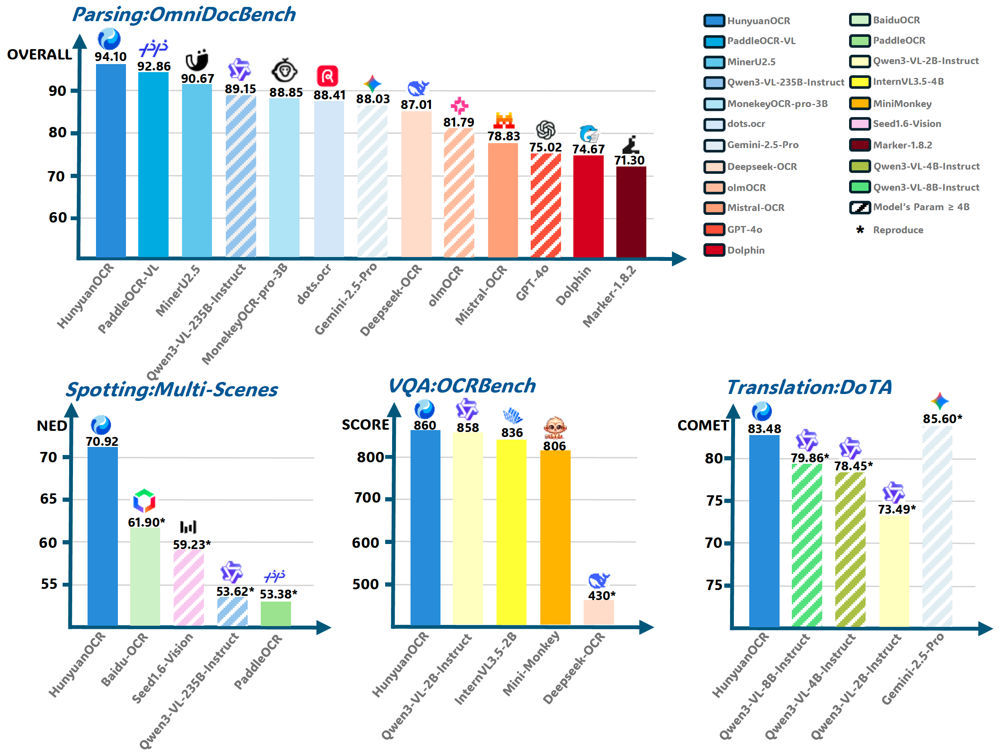
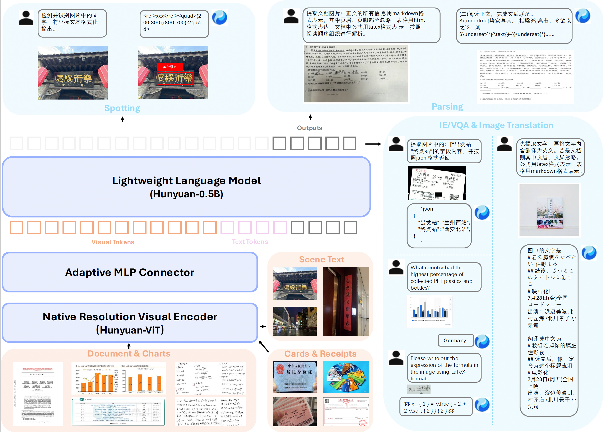
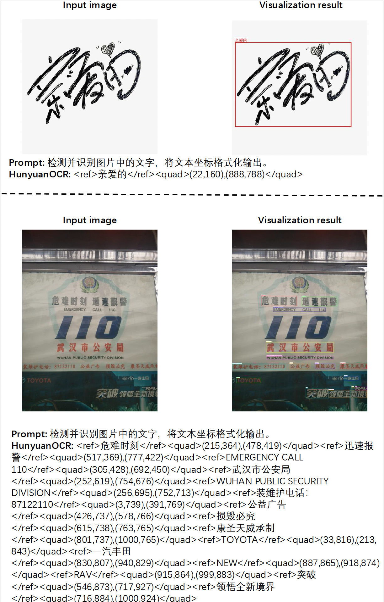
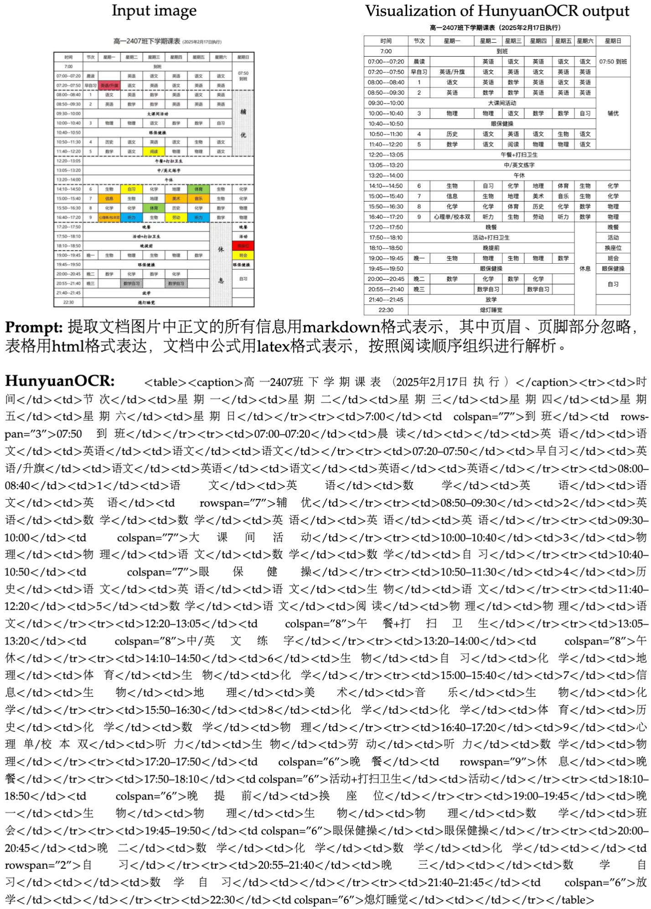
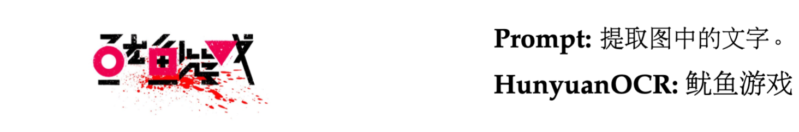
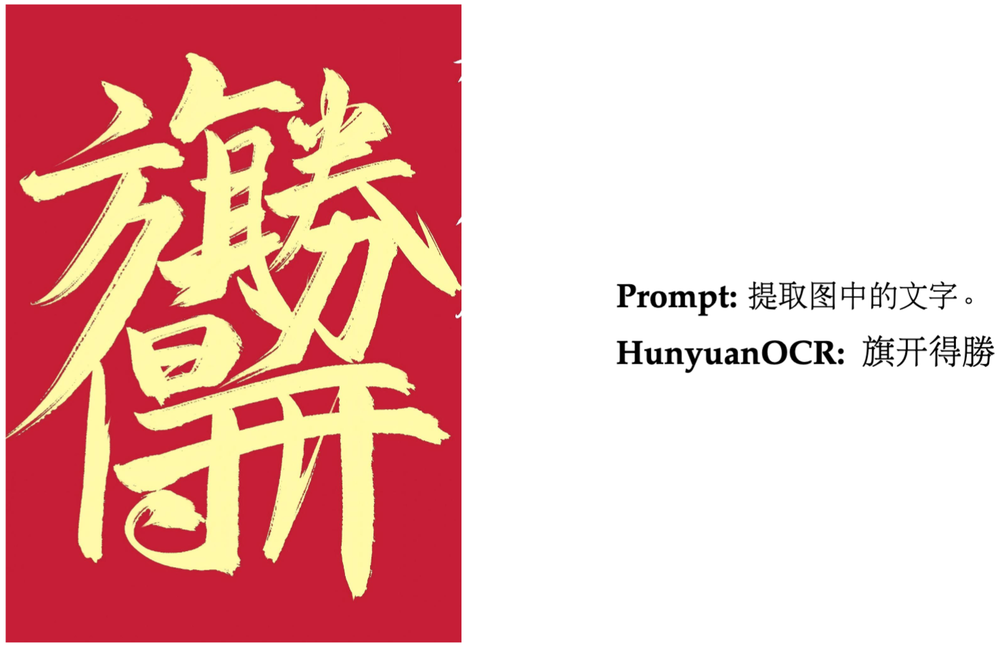
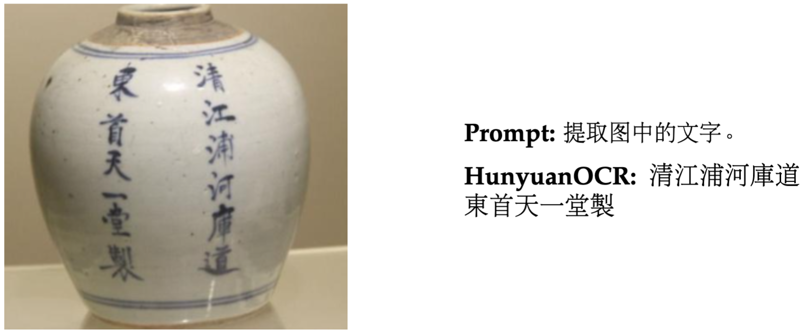

<div align="center">

[English Version](./README.md)

</div>

<div align="center">

# 混元OCR：混元原生多模态端到端 OCR 专家，1B 轻量化参数却斩获多项业界 SOTA！

</div>
<p align="center">
  <br>
</p>


<p align="center">
<a href="https://huggingface.co/spaces/tencent/HunyuanOCR"><b>🎯 在线Demo体验</b></a> |
<a href="https://huggingface.co/tencent/HunyuanOCR"><b>📥 模型权重下载</b></a> |
<a href="https://github.com/Tencent-Hunyuan/HunyuanOCR/blob/main/HunyuanOCR_Technical_Report.pdf"><b>📄 技术报告</b></a>
</p>

## 🔥 最新动态
- **[2025/11/25]** 📝 推理代码和模型权重已开源。

## 📖 简介
**HunyuanOCR**是一款基于腾讯混元原生多模态架构的端到端OCR专家模型。仅以**1B**轻量化参数，便已斩获多项业界SOTA成绩。该模型精通**复杂多语种文档解析**，同时在**文字检测识别、开放字段信息抽取、视频字幕识别、拍照翻译**等全场景实用技能中表现出色。


## ✨ 核心特点

- 💪 **轻量化架构**：基于混元原生多模态架构与训练策略，打造仅1B参数的OCR专项模型，大幅降低部署成本。

- 📑 **全场景功能**：单一模型覆盖文字检测和识别、复杂文档解析、卡证票据字段抽取、字幕提取等OCR经典任务，更支持端到端拍照翻译与文档问答。

- 🚀 **极致易用**：深度贯彻大模型"端到端"理念，单一指令、单次推理直达SOTA结果，较业界级联方案更高效便捷。

- 🌏 **多语种支持**：支持超过100种语言，在单语种和混合语言场景下均表现出色。

<div align="left">
  
</div>

## 🛠️ 环境依赖与安装

### 系统要求
- 🖥️ 操作系统：Linux
- 🐍 Python版本：3.12+（推荐）
- ⚡ CUDA版本：12.8
- 🔥 PyTorch版本：2.7.1
- 🎮 GPU：支持CUDA的NVIDIA显卡
- 🧠 GPU显存：80GB 
- 💾 磁盘空间：6GB

## 🚀 基于vLLM快速使用

### 安装步骤
```bash
pip install vllm --extra-index-url https://wheels.vllm.ai/nightly
```

### 模型推理

```python
from vllm import LLM, SamplingParams
from PIL import Image
from transformers import AutoProcessor

model_path = "tencent/HunyuanOCR"
llm = LLM(model=model_path, trust_remote_code=True)
processor = AutoProcessor.from_pretrained(model_path)
sampling_params = SamplingParams(temperature=0, max_tokens=16384)

img_path = "/path/to/image.jpg"
img = Image.open(img_path)
messages = [
    {"role": "user", "content": [
        {"type": "image", "image": img_path},
        {"type": "text", "text": "Detect and recognize text in the image, and output the text coordinates in a formatted manner."}
    ]}
]
prompt = processor.apply_chat_template(messages, tokenize=False, add_generation_prompt=True)
inputs = {"prompt": prompt, "multi_modal_data": {"image": [img]}}
output = llm.generate([inputs], sampling_params)[0]
print(output.outputs[0].text)
```


## 🚀 基于Transformers快速使用

### 安装步骤

```bash
pip install git+https://github.com/huggingface/transformers@82a06db03535c49aa987719ed0746a76093b1ec4
```

> **Note**: 我们稍后会将其合并到Transformers主分支中。

### 模型推理

HunyuanOCR 提供直观的模型推理接口。以下是使用指引：

```python
from transformers import AutoProcessor
from transformers import HunYuanVLForConditionalGeneration
from PIL import Image
import torch

model_name_or_path = "tencent/HunyuanOCR"
processor = AutoProcessor.from_pretrained(model_name_or_path, use_fast=False)
img_path = "path/to/your/image.jpg"
image_inputs = Image.open(img_path)
messages1 = [
    {
        "role": "user",
        "content": [
            {"type": "image", "image": img_path},
            {"type": "text", "text": (
                "Extract all information from the main body of the document image "
                "and represent it in markdown format, ignoring headers and footers. "
                "Tables should be expressed in HTML format, formulas in the document "
                "should be represented using LaTeX format, and the parsing should be "
                "organized according to the reading order."
            )},
        ],
    }
]
messages = [messages1]
texts = [
    processor.apply_chat_template(msg, tokenize=False, add_generation_prompt=True)
    for msg in messages
]
inputs = processor(
    text=texts,
    images=image_inputs,
    padding=True,
    return_tensors="pt",
)
model = HunYuanVLForConditionalGeneration.from_pretrained(
    model_name_or_path,
    attn_implementation="eager",
    dtype=torch.bfloat16,
    device_map="auto"
)
with torch.no_grad():
    device = next(model.parameters()).device
    inputs = inputs.to(device)
    generated_ids = model.generate(**inputs, max_new_tokens=1024, do_sample=False)
if "input_ids" in inputs:
    input_ids = inputs.input_ids
else:
    print("inputs: # fallback", inputs)
    input_ids = inputs.inputs
generated_ids_trimmed = [
    out_ids[len(in_ids):] for in_ids, out_ids in zip(input_ids, generated_ids)
]
output_texts = processor.batch_decode(
    generated_ids_trimmed, skip_special_tokens=True, clean_up_tokenization_spaces=False
)
print(output_texts)
```

#### 或者，也可以直接使用提供的推理脚本：
```shell
cd Hunyuan-OCR-master/Hunyuan-OCR-hf && python run_hy_ocr.py
```

## 💬 推荐的OCR任务提示词
| 任务 | 中文提示词 | 英文提示词 |
|------|---------|---------|
| **文字检测识别** | 检测并识别图片中的文字，将文本坐标格式化输出。 | Detect and recognize text in the image, and output the text coordinates in a formatted manner. |
| **文档解析** | • 识别图片中的公式，用 LaTeX 格式表示。<br><br>• 把图中的表格解析为 HTML。<br><br>• 解析图中的图表，对于流程图使用 Mermaid 格式表示，其他图表使用 Markdown 格式表示。<br><br>• 提取文档图片中正文的所有信息用 markdown 格式表示，其中页眉、页脚部分忽略，表格用 html 格式表达，文档中公式用 latex 格式表示，按照阅读顺序组织进行解析。 | • Identify the formula in the image and represent it using LaTeX format.<br><br>• Parse the table in the image into HTML.<br><br>• Parse the chart in the image; use Mermaid format for flowcharts and Markdown for other charts.<br><br>• Extract all information from the main body of the document image and represent it in markdown format, ignoring headers and footers. Tables should be expressed in HTML format, formulas in the document should be represented using LaTeX format, and the parsing should be organized according to the reading order. |
| **信息抽取** | • 输出 Key 的值。<br><br>• 提取图片中的: ['key1','key2', ...] 的字段内容，并按照 JSON 格式返回。<br><br>• 提取图片中的字幕。 | • Output the value of Key.<br><br>• Extract the content of the fields: ['key1','key2', ...] from the image and return it in JSON format.<br><br>• Extract the subtitles from the image. |
| **翻译** | 先提取文字，再将文字内容翻译为英文。若是文档，则其中页眉、页脚忽略。公式用latex格式表示，表格用html格式表示。 | First extract the text, then translate the text content into English. If it is a document, ignore the header and footer. Formulas should be represented in LaTeX format, and tables should be represented in HTML format. |

## 📊 评测指标

> **Note**: 竞品评测指标来源：官方report指标(如有)，或竞品模型/接口以及推荐的标准指令复现所得(如无)。

> **Note**: HunyuanOCR评测指标使用TensorRT框架推理所得，可能与Transformers/vLLM的推理方式存在轻微差异。

### 自建评测集上的文字检测识别指标

| Model Type | Methods | Overall | Art | Doc | Game | Hand | Ads | Receipt | Screen | Scene | Video |
|------------|---------|---------|-----|-----|------|------|-----|----------|---------|--------|--------|
| **Traditional methods** | PaddleOCR | 53.38 | 32.83 | 70.23 | 51.59 | 56.39 | 57.38 | 50.59 | 63.38 | 44.68 | 53.35 |
| **Traditional methods** | BaiduOCR | 61.9 | 38.5 | **78.95** | 59.24 | 59.06 | 66.7 | **63.66** | 68.18 | 55.53 | 67.38 |
| **General VLM** | Qwen3VL-2B-Instruct | 29.68 | 29.43 | 19.37 | 20.85 | 50.57 | 35.14 | 24.42 | 12.13 | 34.90 | 40.1 |
| **General VLM** | Qwen3VL-235B-Instruct | 53.62 | 46.15 | 43.78 | 48.00 | 68.90 | 64.01 | 47.53 | 45.91 | 54.56 | 63.79 |
| **General VLM** | Seed-1.6-Vision | 59.23 | 45.36 | 55.04 | 59.68 | 67.46 | 65.99 | 55.68 | 59.85 | 53.66 | 70.33 |
| **OCR-Specific VLM** | HunyuanOCR | **70.92** | **56.76** | 73.63 | **73.54** | **77.10** | **75.34** | 63.51 | **76.58** | **64.56** | **77.31** |

> **总结**: HunyuanOCR OCR在各种场景下均取得了最佳的整体性能（70.92%），显著优于传统的OCR方法和常见的VLM。

### OmniDocBench 以及自建多语种评测集上的文档解析指标 (使用编辑距离评测)

| Model Type | Method | Size | OmniDocBench | | | | Wild-OmniDocBench | | | | DocML |
|:-----------|:-------|:-----|:---------|:---------|:----------|:--------|:----------|:---------|:----------|:---------|:--------|
| | | | overall | text | formula | table | overall | text | formula | table | |
| **General VLMs** | Gemni-2.5-pro | - | 88.03 | 0.075 | 85.92 | 85.71 | - | - | - | - | 82.64 |
| **General VLMs** | Qwen3-VL-235B | 235B | 89.15 | 0.069 | 88.14 | 86.21 | 79.69 | 0.09 | 80.67 | 68.31 | 81.40 |
| **Specialized VLMs (Modular)** | MonkeyOCR-pro-3B | 3B | 88.85 | 0.075 | 87.5 | 86.78 | 70.00 | 0.211 | 63.27 | 67.83 | 56.50 |
| **Specialized VLMs (Modular)** | MinerU2.5 | 1.2B | 90.67 | 0.047 | 88.46 | 88.22 | 70.91 | 0.218 | 64.37 | 70.15 | 52.05 |
| **Specialized VLMs (Modular)** | PaddleOCR-VL | 0.9B | 91.93 | 0.039 | 88.67 | 91.01 | 72.19 | 0.232 | 65.54 | 74.24 | 57.42 |
| **Specialized VLMs (End2End)** | Mistral-OCR | - | 78.83 | 0.164 | 82.84 | 70.03 | - | - | - | - | 64.71 |
| **Specialized VLMs (End2End)** | Deepseek-OCR | 3B | 87.01 | 0.073 | 83.37 | 84.97 | 74.23 | 0.178 | 70.07 | 70.41 | 57.22 |
| **Specialized VLMs (End2End)** | dots.ocr | 3B | 88.41 | 0.048 | 83.22 | 86.78 | 78.01 | 0.121 | 74.23 | 71.89 | 77.50 |
| **Specialized VLMs (End2End)** | **HunyuanOCR** | 1B | **94.10** | 0.042 | **94.73** | **91.81** | **85.21** | **0.081** | **82.09** | **81.64** | **91.03** |

> **总结**: HunyuanOCR 在多语种文档解析方面均表现出优异的性能，在大多数类别中实现了最低的编辑距离。

### 信息抽取 (自建评测集) 和 OCRbench的指标

| Model | Cards | Receipts | Video Subtitles | OCRBench |
|:------|:------|:---------|:----------------|:----------|
| DeepSeek-OCR | 10.04 | 40.54 | 5.41 | 430 |
| PP-ChatOCR | 57.02 | 50.26 | 3.1 | - |
| Qwen3-VL-2B-Instruct | 67.62 | 64.62 | 3.75 | 858 |
| Seed-1.6-Vision | 70.12 | 67.5 | 60.45 | 881 |
| Qwen3-VL-235B-A22B-Instruct | 75.59 | 78.4 | 50.74 | **920** |
| Gemini-2.5-Pro | 80.59 | 80.66 | 53.65 | 872 |
| **HunyuanOCR** | **92.29** | **92.53** | **92.87** | 860 |

> **总结**: HunyuanOCR 在卡证票据信息抽取和视频字幕提取任务上，性能均显著优于常见的VLM模型，同时在OCRBench上也达到了同样量级模型的SOTA效果。

### 自建评测集上的拍照翻译指标

| Method | Size | Other2En | Other2Zh | DoTA (en2zh) |
|--------|------|-----------|-----------|--------------|
| Gemini-2.5-Flash | - | 79.26 | 80.06 | 85.60 |
| Qwen3-VL-235B-Instruct | 235B | 73.67 | 77.20 | 80.01 |
| Qwen3-VL-8B-Instruct | 4B | 75.09 | 75.63 | 79.86 |
| Qwen3-VL-4B-Instruct | 4B | 70.38 | 70.29 | 78.45 |
| Qwen3-VL-2B-Instruct | 2B | 66.30 | 66.77 | 73.49 |
| **HunyuanOCR** | **1B** | 73.38 | 73.62 | 83.48 |

> **总结**: HunyuanOCR仅使用1B参数量，在拍照翻译任务上取得了与Gemini-2.5-Flash以及Qwen3-VL-235B相当的效果。

## 💡 效果可视化
<details>
<summary><u style="color: #2E64FE;">点击展开详情</u></summary>

### 文字检测识别

旨在对文字图像中出现的所有文字，按照行级别粒度进行文本内容和对应的坐标信息输出。我们的模型对文档、艺术字、街景、手写、广告、票据、截屏、游戏、视频等场景上表现卓越。


<p align="left">
  <br>
  <br>
</p>


### 复杂文档解析

对多语种文档扫描件或拍摄图像进行电子化，具体地，是将图片中出现的文本内容按照阅读顺序进行组织、公式采用Latex格式、复杂表格采用HTML格式表达。

<p align="left">
  <br>
   <br>
   <br>
   <br>
   <br>
   <br>
   <br>
   <br>
   <br>
   <br>
   <br>
   <br>
</p>


### 开放字段信息提取

对常见卡证和票据的感兴趣字段（如姓名/地址/单位等），采用标准的json格式解析。

<p align="left">
  <br>
</p>

<p align="left">
  <br>
</p>

**Prompt:**
提取图片中的：['单价', '上车时间', '发票号码', '省前缀', '总金额', '发票代码', '下车时间', '里程数']的字段内容，并且按照JSON格式返回。

**Response:**
```json
{
    "单价": "3.00",
    "上车时间": "09:01",
    "发票号码": "42609332",
    "省前缀": "陕",
    "总金额": "￥77.10元",
    "发票代码": "161002018100",
    "下车时间": "09:51",
    "里程数": "26.1km"
}
```

### 视频字幕提取

能够对视频的字幕实现自动化抽取，包括双语字幕。


<p align="left">
  <br>
  <br>
  <br>
</p>


### 图片翻译功能

对拍照或者字典文档的多语种图片能够进行端到端翻译成中文或英文的文本格式输出，目前主要支持14种高频应用小语种（具体包括：德语、西班牙语、土耳其语、意大利语、俄语、法语、葡萄牙语、阿拉伯语、泰语、越南语、印尼语、马来语、日语、韩语）翻译成中/英文，以及中英互译功能（参加ICDAR2025文档端到端翻译比赛赢得了小模型赛道冠军成绩）。


<p align="left">
  <br>
</p>

</details>


## 📚 引用
@misc{hunyuanocr2025,
    title={HunyuanOCR Technical Report},
    author={Tencent Hunyuan Vision Team},
    year={2025},
    publisher={GitHub},
    journal={GitHub repository},
    howpublished={\url{https://github.com/Tencent-Hunyuan/HunyuanOCR}}
}

## 🙏 致谢
我们衷心感谢[PaddleOCR](https://github.com/PaddlePaddle/PaddleOCR)、[MinerU](https://github.com/opendatalab/MinerU)、[MonkeyOCR](https://github.com/Yuliang-Liu/MonkeyOCR)、[DeepSeek-OCR](https://github.com/deepseek-ai/DeepSeek-OCR)、[dots.ocr](https://github.com/rednote-hilab/dots.ocr) 的作者和贡献者，感谢他们杰出的开源工作和宝贵的研究思路。

同时我们也感谢以下宝贵的开源数据集：[OminiDocBench](https://github.com/opendatalab/OmniDocBench)、[OCRBench](https://github.com/Yuliang-Liu/MultimodalOCR/tree/main/OCRBench)、[DoTA](https://github.com/liangyupu/DIMTDA)。

特别感谢vLLM社区在推理部署方面所提供的即时支持。
