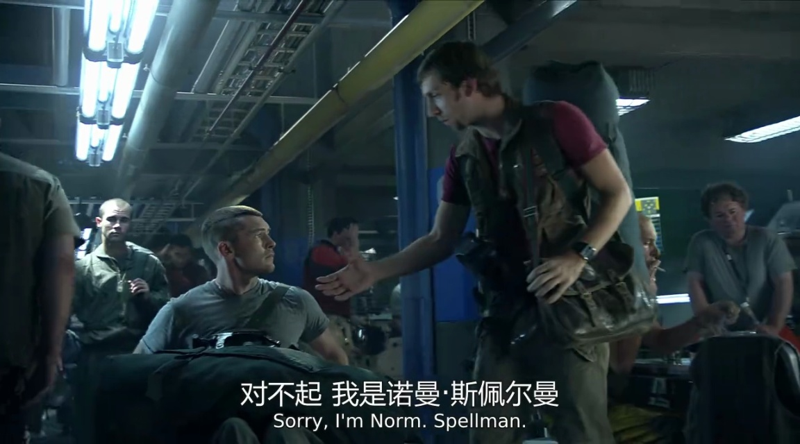

<div align="center">

[中文](./README_zh.md) | [English](./README.md)

</div>

<div align="center">

# 混元OCR：原生多模态端到端 OCR 专家，1B 轻量化参数却斩获多项业界 SOTA！

</div>
<p align="center">
  <br>
</p>

<div align="center">


📑 论文与模型权重即将发布！

[演示](http://29.210.129.176:8080/) | [安装](#环境依赖与安装) | [快速开始](#基于transformers快速使用) | [提示词](#推荐的ocr任务提示词) | [文档](#引用)
</div>

## 🔥 最新动态
- **[2025/11/20]** 📝 推理代码和模型权重已开源。

## 📖 简介
**HunyuanOCR**是一款基于混元原生多模态架构的端到端OCR专家模型。仅以**1B**轻量化参数，便已斩获多项业界SOTA成绩。该模型精通**复杂文档解析**，同时在**多语种文字识别、开放字段信息抽取、视频字幕识别、拍照翻译**等全场景实用技能中表现出色。

基于腾讯混元技术打造，该模型通过端到端架构设计和单次推理，提供卓越性能的同时大幅简化部署流程，在与传统级联系统和商用API的对比中保持竞争优势。

## ✨ 核心特点

- 💪 **轻量化架构**：基于混元原生多模态架构与训练策略，打造仅1B参数的OCR专项模型，大幅降低部署成本。

- 📑 **全场景功能**：单一模型覆盖文字检测和识别、复杂文档解析、卡证票据字段抽取、字幕提取等OCR经典任务，更支持端到端拍照翻译与文档问答。

- 🚀 **极致易用**：深度贯彻大模型"端到端"理念，单一指令、单次推理直达SOTA结果，较业界级联方案更高效便捷。

- 🌏 **多语种支持**：支持超过100种语言，在单语种和混合语言场景下均表现出色。

<div align="left">
  
</div>

## 🛠️ 环境依赖与安装

### 系统要求
- 🖥️ 操作系统：Linux
- 🐍 Python版本：3.12+（推荐）
- ⚡ CUDA版本：12.8
- 🔥 PyTorch版本：2.7.1
- 🎮 GPU：支持CUDA的NVIDIA显卡
- 🧠 GPU显存：≥3×80GB（推荐4×80GB以获得更好性能）
- 💾 磁盘空间：170GB（用于存储模型权重）

### 安装步骤
```bash
pip install https://mirrors.tencent.com/repository/generic/transformers/transformers-4.56.0.post2-py3-none-any.whl
pip install opencv-python-headless
pip install torch==2.7.1 torchvision==0.22.1 torchaudio==2.7.1 --index-url https://download.pytorch.org/whl/cu128
```

## 🚀 基于Transformers快速使用

### 模型推理

HunyuanOCR 提供直观的模型推理接口。以下是使用指引：

```python
from transformers import AutoProcessor
from transformers import HunYuanVLForConditionalGeneration
from PIL import Image
import numpy as np
import requests
import torch

import base64
import requests
from io import BytesIO

def get_image(input_source):
    if input_source.startswith(('http://', 'https://')):
        response = requests.get(input_source)
        response.raise_for_status()
        return Image.open(BytesIO(response.content))
    else:
        return Image.open(input_source)

def main():
    model_name_or_path = "tencent/HunyuanOCR"
    processor = AutoProcessor.from_pretrained(model_name_or_path, use_fast=False)
    img_path = "https://huggingface.co/datasets/huggingface/documentation-images/resolve/main/chat-ui/tools-dark.png"
    messages1 = [
        {
            "role": "user",
            "content": [
                {"type": "image", "image": img_path},
                {"type": "text", "text": (
                    "Extract all information from the main body of the document image "
                    "and represent it in markdown format, ignoring headers and footers. "
                    "Tables should be expressed in HTML format, formulas in the document "
                    "should be represented using LaTeX format, and the parsing should be "
                    "organized according to the reading order."
                )},
            ],
        }
    ]
    messages = [messages1]
    texts = [
        processor.apply_chat_template(msg, tokenize=False, add_generation_prompt=True)
        for msg in messages
    ]
    image_inputs = get_image(img_path)
    inputs = processor(
        text=texts,
        images=image_inputs,
        padding=True,
        return_tensors="pt",
    )
    model = HunYuanVLForConditionalGeneration.from_pretrained(
        model_name_or_path,
        attn_implementation="eager",
        dtype=torch.bfloat16,
        device_map="auto"
    )
    with torch.no_grad():
        device = next(model.parameters()).device
        inputs = inputs.to(device)
        generated_ids = model.generate(**inputs, max_new_tokens=1024, do_sample=False)
    if "input_ids" in inputs:
        input_ids = inputs.input_ids
    else:
        print("inputs: # fallback", inputs)
        input_ids = inputs.inputs
    generated_ids_trimmed = [
        out_ids[len(in_ids):] for in_ids, out_ids in zip(input_ids, generated_ids)
    ]
    output_texts = processor.batch_decode(
        generated_ids_trimmed, skip_special_tokens=True, clean_up_tokenization_spaces=False
    )
    print(output_texts)

if __name__ == '__main__':
    main()
```

#### 或者，也可以直接使用提供的推理脚本：
```shell
cd Hunyuan-OCR-master/Hunyuan-OCR-hf && python run_hy_ocr.py
```

## 💬 推荐的OCR任务提示词
| 任务 | 中文提示词 | 英文提示词 |
|------|---------|---------|
| **文字检测识别** | 检测并识别图片中的文字，将文本坐标格式化输出。 | Detect and recognize text in the image, and output the text coordinates in a formatted manner. |
| **文档解析** | • 识别图片中的公式，用 LaTeX 格式表示。<br><br>• 把图中的表格解析为 HTML。<br><br>• 解析图中的图表，对于流程图使用 Mermaid 格式表示，其他图表使用 Markdown 格式表示。<br><br>• 提取文档图片中正文的所有信息用 markdown 格式表示，其中页眉、页脚部分忽略，表格用 html 格式表达，文档中公式用 latex 格式表示，按照阅读顺序组织进行解析。 | • Identify the formula in the image and represent it using LaTeX format.<br><br>• Parse the table in the image into HTML.<br><br>• Parse the chart in the image; use Mermaid format for flowcharts and Markdown for other charts.<br><br>• Extract all information from the main body of the document image and represent it in markdown format, ignoring headers and footers. Tables should be expressed in HTML format, formulas in the document should be represented using LaTeX format, and the parsing should be organized according to the reading order. |
| **信息抽取** | • 输出 Key 的值。<br><br>• 提取图片中的: ['key1','key2', ...] 的字段内容，并按照 JSON 格式返回。<br><br>• 提取图片中的字幕。 | • Output the value of Key.<br><br>• Extract the content of the fields: ['key1','key2', ...] from the image and return it in JSON format.<br><br>• Extract the subtitles from the image. |
| **翻译** | 先提取文字，再将文字内容翻译为英文。若是文档，则其中页眉、页脚忽略。公式用latex格式表示，表格用html格式表示。 | First extract the text, then translate the text content into English. If it is a document, ignore the header and footer. Formulas should be represented in LaTeX format, and tables should be represented in HTML format. |

## 📊 评测指标

### 自建评测集上的文字检测识别指标

| Model Type | Methods | Overall | Art | Doc | Game | Hand | Ads | Receipt | Screen | Scene | Video |
|------------|---------|---------|-----|-----|------|------|-----|----------|---------|--------|--------|
| **Traditional methods** | PaddleOCR | 53.38 | 32.83 | 70.23 | 51.59 | 56.39 | 57.38 | 50.59 | 63.38 | 44.68 | 53.35 |
| | BaiduOCR | 61.9 | 38.5 | **78.95** | 59.24 | 59.06 | 66.7 | **63.66** | 68.18 | 55.53 | 67.38 |
| **General VLM** | Qwen3VL-2B-Instruct | 29.68 | 29.43 | 19.37 | 20.85 | 50.57 | 35.14 | 24.42 | 12.13 | 34.90 | 40.1 |
| | Qwen3VL-235B-Instruct | 53.62 | 46.15 | 43.78 | 48.00 | 68.90 | 64.01 | 47.53 | 45.91 | 54.56 | 63.79 |
| | Seed1.6-VL-Instruct | 59.23 | 45.36 | 55.04 | 59.68 | 67.46 | 65.99 | 55.68 | 59.85 | 53.66 | 70.33 |
| **OCR-Specific VLM** | HunyuanOCR | **70.92** | **56.76** | 73.63 | **73.54** | **77.10** | **75.34** | 63.51 | **76.58** | **64.56** | **77.31** |

> **总结**: HunyuanOCR OCR在各种场景下均取得了最佳的整体性能（70.92%），显著优于传统的OCR方法和常见的VLM。

### OmniDocBench 上的文档解析指标 (使用编辑距离评测)

| Model | English |  |  |  | Chinese |  |  |  |
|-------|---------|---------|----------|--------|----------|---------|----------|---------|
|  | overall | text | formula | table | overall | text | formula | table |
| Dolphin | 0.356 | 0.352 | 0.465 | 0.258 | 0.44 | 0.44 | 0.604 | 0.367 |
| SmolDocling | 0.493 | 0.262 | 0.753 | 0.729 | 0.816 | 0.838 | 0.997 | 0.907 |
| dots.ocr-3B | 0.182 | 0.137 | 0.320 | 0.166 | 0.261 | 0.229 | 0.468 | 0.160 |
| HunyuanOCR | **0.123** | 0.049 | **0.242** | 0.147 | **0.157** | 0.087 | **0.377** | **0.08** |

> **总结**: HunyuanOCR 在英语和中文文档解析方面均表现出优异的性能，在大多数类别中实现了最低的编辑距离。

### 信息抽取 (自建评测集) 和 OCRbench的指标

| Model | Cards & Receipts | Video Subtitles | OCRBench |
|-------|------------------|-----------------|-----------|
| DeepSeek-OCR | 25.29 | 5.41 | 430 |
| PP-ChatOCR | 53.64 | 3.1 | - |
| Qwen3VL-2B-Instruct | 66.12 | 3.75 | 858 |
| Seed1.6-VL | 68.81 | 60.45 | 881 |
| Qwen3VL-235B-A22B-Instruct | 77.0 | 50.74 | **920** |
| Gemini-2.5-Pro | 80.63 | 53.65 | 872 |
| **HunyuanOCR (∼1B)** | **92.41** | **92.87** | 860 |

> **总结**: HunyuanOCR 在卡证票据信息抽取和视频字幕提取任务上，性能均显著优于常见的VLM模型，同时在OCRBench上也达到了同样量级模型的SOTA效果。

### 自建评测集上的拍照翻译指标

| Method | Size | Other2En | Other2Zh | DoTA (en2zh) |
|--------|------|-----------|-----------|--------------|
| Gemini-2.5-Flash | - | 79.26 | 80.06 | - |
| Qwen3-VL-235B | 235B | 73.67 | 77.20 | - |
| Qwen3-VL-4B | 4B | 70.38 | 70.29 | - |
| Qwen3-VL-2B | 2B | 66.30 | 66.77 | - |
| **HunyuanOCR** | **1B** | 73.38 | 73.62 | - |

> **总结**: HunyuanOCR仅使用1B参数量，在拍照翻译任务上取得了与Gemini-2.5-Flash以及Qwen3-VL-235B相当的效果。

## 💡 效果可视化
<details>
<summary>点击展开详情</summary>

### 文字检测识别


<p align="left">
  <br>
  <br>
</p>


### 文档解析
<p align="left">
  <br>
</p>

### 信息抽取


<p align="left">
  <br>
</p>

**Prompt:**
提取图片中的：['单价', '上车时间', '发票号码', '省前缀', '总金额', '发票代码', '下车时间', '里程数']的字段内容，并且按照JSON格式返回。

**Response:**
```json
{
    "单价": "3.00",
    "上车时间": "09:01",
    "发票号码": "42609332",
    "省前缀": "陕",
    "总金额": "￥77.10元",
    "发票代码": "161002018100",
    "下车时间": "09:51",
    "里程数": "26.1km"
}
```

<p align="left">
  <br>
</p>

**Prompt:**
提取图中的字幕

**Response:**
对不起 我是诺曼·斯佩尔曼\nSorry, I'm Norm. Spellman.


### 翻译
<p align="left">
  <br>
</p>

</details>


## 📚 引用
@misc{hunyuanocr2025,
    title={HunyuanOCR: Advanced OCR Engine for Document Understanding},
    author={Tencent Hunyuan Team},
    year={2025},
    publisher={GitHub},
    journal={GitHub repository},
    howpublished={\url{https://github.com/Tencent/HunyuanOCR}}
}

## 🙏 致谢
感谢所有为HunyuanOCR的开发做出贡献的人们

特别感谢腾讯混元团队

我们感谢开源社区的支持。


## 📄 许可证
本项目采用 Apache 2.0 许可证。
